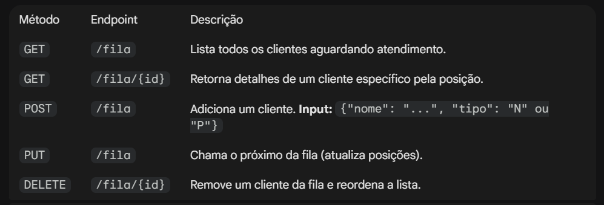

# 🎫 API de Gerenciamento de Filas de Atendimento

> Projeto final desenvolvido para a disciplina de Back-end, simulando um sistema inteligente de controle de filas para totens de atendimento.

---

## 🚀 Sobre o Projeto

Esta API RESTful foi construída com **FastAPI** para gerenciar a entrada e saída de clientes em uma fila de estabelecimento. O grande diferencial é a **Lógica de Prioridade**, onde clientes preferenciais são automaticamente realocados na frente da fila, respeitando a ordem de chegada entre eles.

### ✨ Funcionalidades Principais

* **👥 Gestão de Fila:** Adicionar, listar, buscar e remover clientes.
* **⚡ Sistema de Prioridade (Bônus):** Clientes do tipo "Prioritário" (P) furam a fila dos "Normais" (N) automaticamente.
* **🔄 Reordenação Dinâmica:** A posição na fila é recalculada em tempo real sempre que alguém chega, sai ou é atendido.
* **🛡️ Validação de Dados:** Uso de Pydantic para garantir integridade das entradas (limite de caracteres, tipos válidos).
* **☁️ Deploy:** Projeto configurado e rodando na nuvem via Heroku.

---

## 🛠️ Tecnologias Utilizadas

* **Linguagem:** Python
* **Framework:** FastAPI
* **Servidor:** Uvicorn
* **Deploy:** Heroku

---

## ⚙️ Como Rodar Localmente

Siga os passos abaixo para testar o projeto na sua máquina:

1. **Clone o repositório**

   git clone https://github.com/SimoneSoaress/api-fila-atendimento.git
  
2. **Crie e ative o ambiente virtual**
    # Windows
        python -m venv venv
        venv\Scripts\activate

    # Linux/Mac
        python3 -m venv venv
        source venv/bin/activate

3. **Instale as dependências**

    pip install -r requirements.txt

4. **Execute a aplicação**

    uvicorn main:app --reload

5. **Acesse a Documentação Interativa Abra seu navegador:**

    http://127.0.0.1:8000/docs

📚 Documentação da API
Abaixo estão os endpoints disponíveis. Recomenda-se testar via Swagger UI (/docs).
    

🌐 Link do Projeto Online
Você pode testar a API rodando diretamente na nuvem:

🔗 Acessar API no Heroku

📝 Autor
Desenvolvido por Simone Mayara